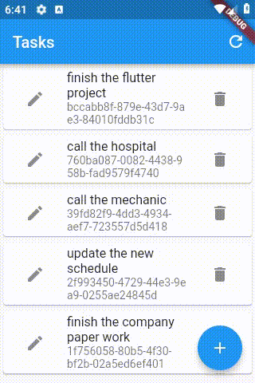

# e015_flutter_animatedlist_sizetransition_e004base

## Based On e014

- [elrashid-flutter-examples/e014_flutter_animatedlist_noanimation_e004base](https://github.com/elrashid-flutter-examples/e014_flutter_animatedlist_noanimation_e004base)

  - Based On e004 :

    - [elrashid-flutter-examples/e004_flutter_listview_crud_app_using_nonsecure_rest_api](https://github.com/elrashid-flutter-examples/e004_flutter_listview_crud_app_using_nonsecure_rest_api)

## Screen Record

## What

- SizeTransition + AnimatedList for tasks in flutter Task app (e004)

- must run with :

  - [elrashid-flutter-examples/e002-aspcore-rest-api-server-for-flutter](https://github.com/elrashid-flutter-examples/e002-aspcore-rest-api-server-for-flutter)

## Full code

    AnimatedList(
    key: _myListKey,
    initialItemCount: tasks.length,
    itemBuilder: (context, index, Animation<double> animation) =>
        SizeTransition(
        axis: Axis.vertical,
        sizeFactor: animation,
        child: TaskWidget(
        taskOpj: tasks[index],
        notifyParent: refresh,
        ),
    ),
    ),

## Ref

- [e014](https://github.com/elrashid-flutter-examples/e014_flutter_animatedlist_noanimation_e004base)
